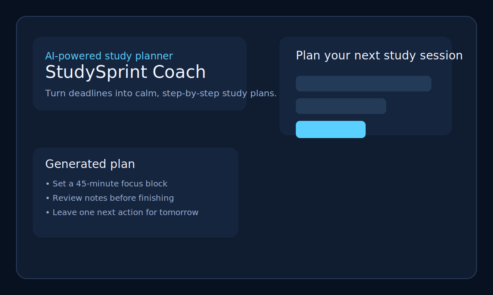
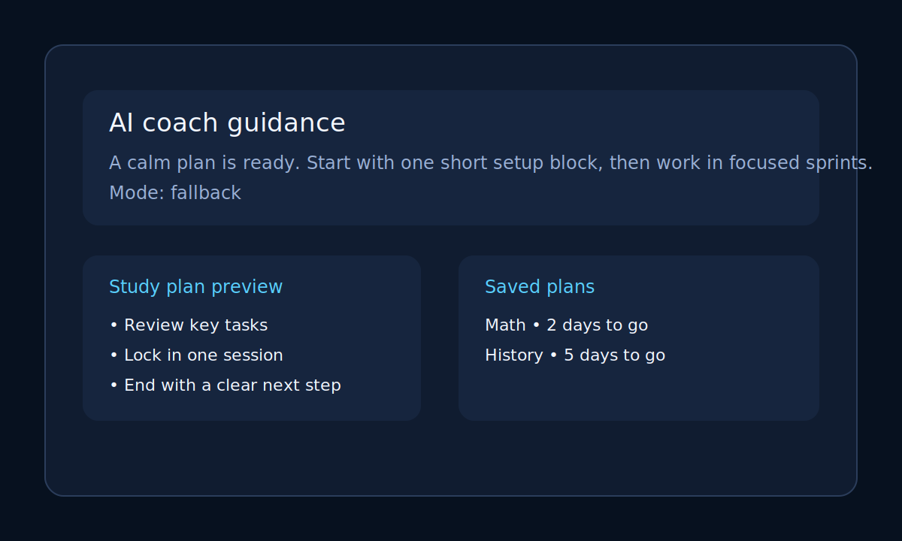
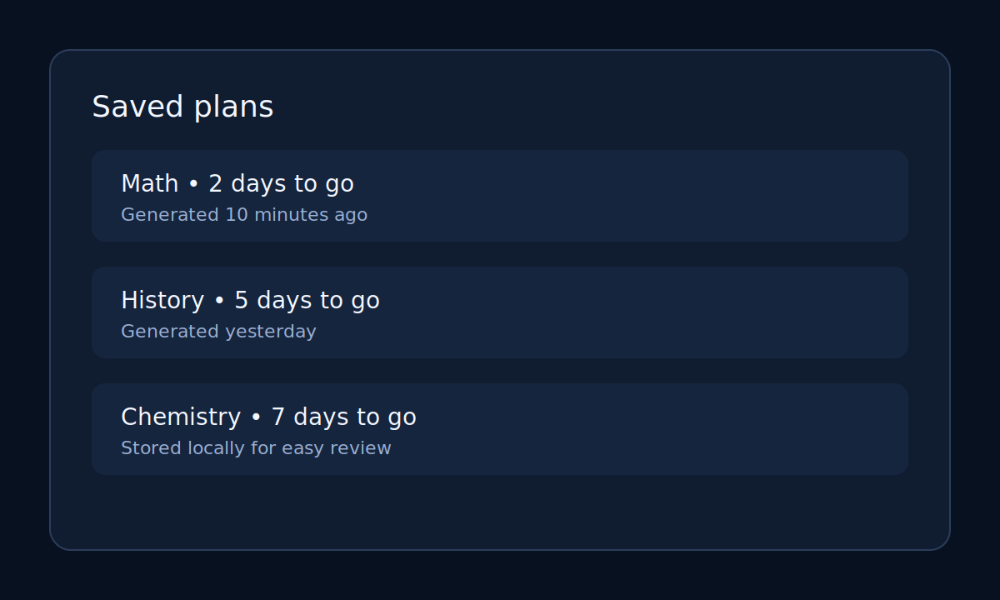

# StudySprint Coach

## What it does
StudySprint Coach is a student-focused web app that turns a messy deadline into a calm, realistic study plan. It helps learners break their workload into manageable blocks, track momentum, and get AI-style guidance that feels encouraging rather than overwhelming.

## The real problem it solves
Students often know what needs to be done but struggle to turn their tasks into a plan they can actually follow. This app helps them create structure quickly, especially when deadlines are close and stress is high.

## Live deployment
Open the app here: https://studysprint-coach.vercel.app/

## Features
- Guided study-planning form for course, deadline, workload, focus, energy, and goal
- Instant generation of a structured study plan and coaching message
- Local storage for saved plans so students can revisit prior ideas
- AI-powered coaching message backed by an explicit instruction prompt
- Lightweight server so the app can run locally or be deployed easily

## AI feature
The app includes an AI-powered coaching layer that turns a student’s input into a supportive plan. The system instructions are:

> You are StudySprint Coach, a calm and encouraging student study planner. Create a realistic plan with short focus blocks and a motivational ending.

The app uses the OpenAI Chat Completions API when an API key is available, and otherwise falls back to a built-in coaching response so the experience still works.

## Tools and services used
- HTML, CSS, and JavaScript for the front end
- Node.js HTTP server for local development and deployment readiness
- OpenAI API for the AI coaching feature
- Vercel-ready static deployment structure

## Screenshots
1. 
2. 
3. 

## How to run locally
1. Install Node.js.
2. Open the project folder in a terminal.
3. Run: node server.js
4. Open http://localhost:3000 in your browser.

## Notes for submission
This project was designed to be easy to ship publicly while still feeling like a real, useful product. The app is intentionally focused on a real student problem and includes an original AI feature.
